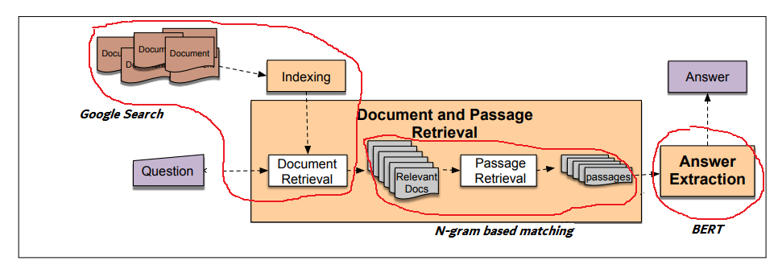

# Vietnamese question answering with BERT

- Q: Người giàu nhất việt nam (richest man in Vietnam) ?
- A: Phạm Nhật Vượng

- Q: Ai là tác giả của ngôn ngữ lập trình C (Who invented C programming language)
- A: Dennis Ritchie

### Install prerequisites (python3)
pip3 install -r requirements.txt

### Download pretrain model 
Link: https://drive.google.com/open?id=1ml-Qwv4yHxepp852N-aL0U5iZzqLNZ4B
After that, extract and put all files into "resources" directory

### Limitations
Due to the limitation of current dataset, the system only supports questions about person

# Further improvements
 - Add more training data, and more question type as well
 - Leverage english dataset (https://rajpurkar.github.io/SQuAD-explorer/). 
     - You can simply translate English data  --> Vietnamese (using Google Translation API) and concatenate translated data into original dataset. 
     - You can pre-train model on translated data and then retrain on Vietnamese dataset
     - Cross-lingual Transfer Learning approaches
 - Use machine leanring for information retrieval step. Dataset can be found in https://challenge.zalo.ai/portal/question-answering

# Architecture Overview
 - Question Answering based IR - Speech and language processing (daniel jurafsky)
 - https://web.stanford.edu/~jurafsky/slp3/24.pdf
 - For better understanding: Open notebook file --> change the question --> run line by line
 

### Sample:

question = 'ai là người giàu nhất Việt Nam'

### Using google to find relevant documents:

Document 0

Link: https://vi.wikipedia.org/wiki/T%E1%BB%A9_%C4%91%E1%BA%A1i_Ph%C3%BA_h%E1%BB%99

Sample content:

 Tứ đại phú hộ (chữ Hán: 四大富戶) là cụm từ dân gian ở miền Nam Việt Nam đặt ra vào cuối thế kỷ XIX đến đầu thế kỷ XX để chỉ bốn người giàu nhất Sài Gòn, cũng như nhất miền Nam Kỳ lục tỉnh và cả Đông Dương thời bấy giờ. . Để dễ nhớ, dân gian có câu Nhất Sỹ, Nhì Phương, Tam Xường, Tứ Định [1]. . Đây là câu được nhiều người biết. . Tuy nhiên, về vị trí thứ tư, được dành cho một số đại phú hộ khác như Tứ Trạch, Tứ Hỏa hoặc Tứ Bưởi.

Tên thật là Lê Phát Đạt (1841-1900), còn có tên gọi là Sỹ, về sau được .....

------------------------------

Document 1

Link: https://www.bbc.com/vietnamese/world-47844894

Sample content:

 ►► Bí mật trên tờ TIỀN Việt Nam: https://youtu.be/7TZQ83Cg4pY►► Cười cùng Trấn Thành: http://bit.ly/2XVOInt►► Top Video: https://bit.ly/322ffxB►► Miss World Việt Nam: https://youtu.be/CKZyBGdgS5A5 tỷ phú đô la người Việt Nam này là những người góp mặt trong danh sách những tỷ phú giàu nhất thế giới do tạp chí uy tín Forbes bình chọn.► Đăng ký để xem nhiều hơn: https://goo.gl/C6U3V9► Youtube: https://www.youtube.com/senvangtv----------------

TOP 5 TỶ PHÚ GIÀU NHẤT VIỆT NAM - Tiền nhiều để làm gì .....

------------------------------

Document 2

Link: https://www.youtube.com/watch?v=WDJXJd1-Vhc

Sample content:

 Giá trị tài sản của ông Phạm Nhật Vượng đang không ngừng tăng lên qua các giai đoạn thống kê
Thống kê của Forbes cho thấy, tính đến thời điểm 20/3/2019, giá trị tài sản của ông Phạm Nhật Vượng, người giàu nhất Việt Nam hiện nay đã đạt 8,1 tỷ USD, tăng 1,5 tỷ USD so với thời điểm tạp chí này công bố danh sách những người giàu nhất thế giới năm 2019 vào ngày 5/3 vừa qua.
Tuy nhiên, với giá cổ phiếu VIC đã tăng mạnh trong hơn 1 năm qua và đang ở trong vùng đỉnh, khối tài sản của ông Phạm Nhật Vượ .....

------------------------------
...........

### Find relevant passages from documents

Passage ranked 1

VOV.VN - Ông Phạm Nhật Vượng là người giàu nhất Việt Nam với khối tài sản trị giá 6,7 tỷ USD, tương đương 152,9 ngàn tỷ đồng.

------------------------------

Passage ranked 2 

Trước đó vào năm 2010, Phạm Nhật Vượng là người giàu nhất trên TTCK Việt Nam với số tài sản gần 15.800 tỷ đồng, giàu thứ nhì Việt Nam (theo xếp hạng trên sàn chứng khoán) năm 2007, 2008. [4] Ông đạt được vị trí này vào năm 2007, khi Công ty Vinpearl thuộc nhóm các công ty của Vincom niêm yết 100 triệu cổ phiếu trên sàn giao dịch chứng khoán Tp. Hồ Chí Minh.

------------------------------

Passage ranked 3 

Ông Phạm Nhật Vượng tiếp tục được công nhận là người giàu nhất Việt Nam với tài sản định giá 6,6 tỷ USD, đứng thứ 239 thế giới, tăng 2,3 tỷ USD so với năm ngoái.

------------------------------

Passage ranked 4 

“Ai là người giàu nhất Việt Nam?”. báo Tiền Phong. 27/1/2006

------------------------------
.......

### Extracting answers with BERT

Passage:  Ông Phạm Nhật Vượng tiếp tục được công nhận là người giàu nhất Việt Nam với tài sản định giá 6,6 tỷ USD, đứng thứ 239 thế giới, tăng 2,3 tỷ USD so với năm ngoái.

Answer :  Phạm Nhật Vượng

Score  :  0.9999549482428222

------------------------------

Passage:  VOV.VN - Ông Phạm Nhật Vượng là người giàu nhất Việt Nam với khối tài sản trị giá 6,7 tỷ USD, tương đương 152,9 ngàn tỷ đồng.

Answer :  Phạm Nhật Vượng

Score  :  0.9999439551387689

------------------------------

Passage:  Cho đến nay vẫn chưa ai thay thế được vị trí người giàu nhất Việt Nam của ông Phạm Nhật Vượng. Giá trị tài sản của ông Vượng đã tăng “chóng mặt” trong tháng 3/2019 này, tuy nhiên, con số có thể cao hơn cả thống kê của Forbes.

Answer :  Phạm Nhật Vượng

Score  :  0.9999150228723965

------------------------------

Passage:  Trước đó vào năm 2010, Phạm Nhật Vượng là người giàu nhất trên TTCK Việt Nam với số tài sản gần 15.800 tỷ đồng, giàu thứ nhì Việt Nam (theo xếp hạng trên sàn chứng khoán) năm 2007, 2008. [4] Ông đạt được vị trí này vào năm 2007, khi Công ty Vinpearl thuộc nhóm các công ty của Vincom niêm yết 100 triệu cổ phiếu trên sàn giao dịch chứng khoán Tp. Hồ Chí Minh.

Answer :  Phạm Nhật Vượng

Score  :  0.9997637352104664
